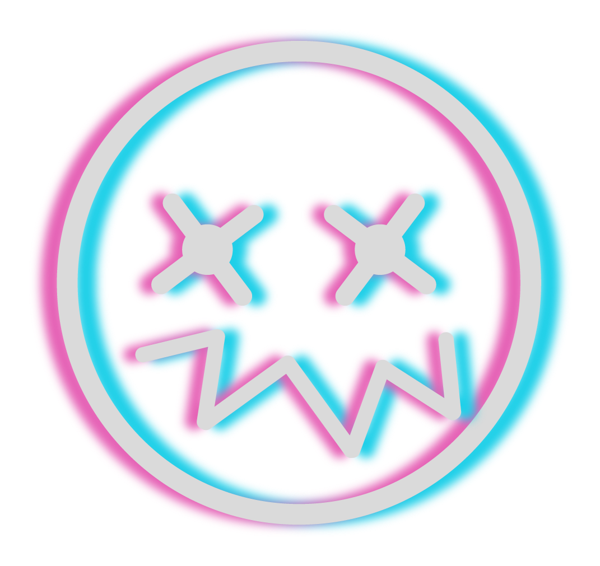

## Adrián Leiva ~ Leivaa 🌴

  
  
  - Started Computer Science degree in 2019 in Cordoba, Spain.
  - Picked Software Engineering specialization in 2021.
  - Joined the [Aula de Software Libre](https://www.uco.es/aulasoftwarelibre/) coordination team in november 2021
  - Joined [Genially](https://genially.com) as Developer Trainee in october 2022
  - Became Junior Backend Developer April 2023

---

Lista de contenidos

- [About me](#about-me)
- [More than just a developer](#more-than-just-a-developer)
- [Projects](#projects)
  - [Simple-CQRS](#simple-cqrs)
- [Coding related](#coding-related)
  - [Methodologies](#methodologies)
  - [Langs](#langs)
  - [Book list](#book-list)
- [Github charts](#github-charts)
- [Contact me](#contact-me)

---

## About me

My life dream as a child was being an inventor. So I growed up to be a software developer focused on fulfilling real needs and bring good alternatives to people in a fully digitalized world.

I also enjoy such things as **Gaming** (_shooters and simracing mostly_) and **Enduro** (I know, they're like sooo far away one from another haha)
 

---

## More than just a developer

I define myself as a _learning enthusiast_, and I love to try new things and learn everything about what I'm doing.
 
Not a fullstack but always willing to know a bit more.
 
Specialized in **backend** and willing to learn more about devops and QA.
 

---

## Projects

Here you have _some_ of my finished / current projects. I dont list here all because they're a lot and a lot of them are just to try and learn new things!
 

### Simple-CQRS

    

- NPM package for quick and simple cqrs implementation with 0 extra dependencies.
- Made for Typescript.
- First release: June 2022
- State: Stable & Improving
- [Take a look!](https://www.npmjs.com/package/@leivaa/simple-cqrs)

---

## Coding related

### Methodologies

As a developer I try to keep my code _as mantainable as possible_ so I try always to keep my code **clean**, _structured_ and `self-documented`, as well as functional.

> "It is not enough for code to work"   \- Robert C. Martin

This is why I keep with methodologies like DDD, TDD and Hexagonal Architecture. 
I think the methodology always should follow principles and not viceversa, so I always focus on keeping the principles listed before and _use_ these methodologies to archieve them rather than using the methodologies because they're cool.

### Langs

The coding langs were I feel more comfortable are:  

 
But I'm open for learning new langs and looking foward to add more to this list.

#### Others

### Book List

I love to read books as a way of opening my mindset and learn new things, so this is a list of books that I have readed or I want to read.
_(Checked = read)_
 

- [x] Clean Code
- [x] Clean Architecture
- [x] Clean Coder
- [ ] The pragmatic programmer
- [ ] Building Microservices
- [ ] Implementing Domain-Driven Design
- [x] CQRS by Example

---

## Github charts

 

---

## Contact me

Email: adrianleivasoftware@gmail.com  

[.](https://twitter.com/Leivaa21_)

